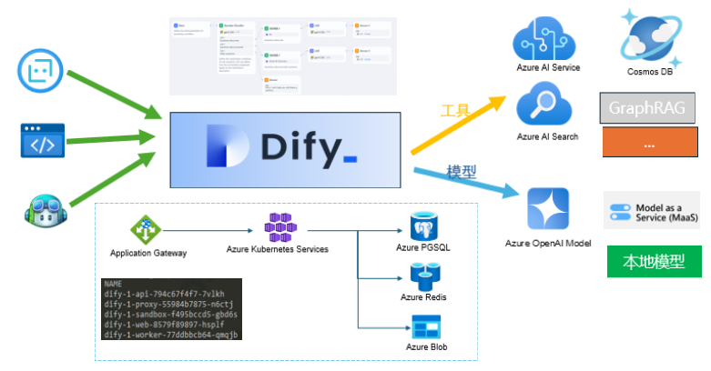

# Dify on Azure
## Overview
HI,this is a simple example of how to deploy a Dify project on Azure. 
## Topology


Before you provision Dify, please check and set the variables in dev-variables.tfvars file.

## Deploy
```bash
terraform init
terraform plan -out=dev-plan -var-file="./environments/dev-variables.tfvars"
terraform apply "dev-plan"
```
